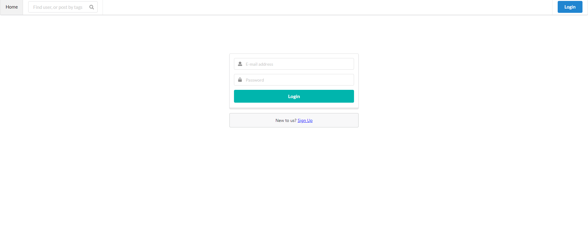
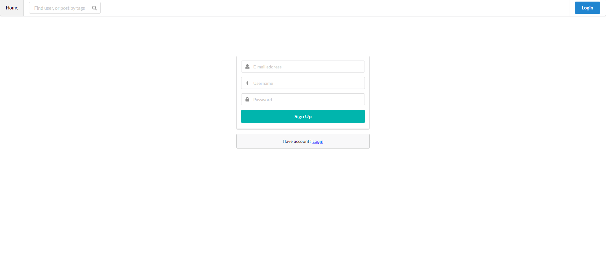
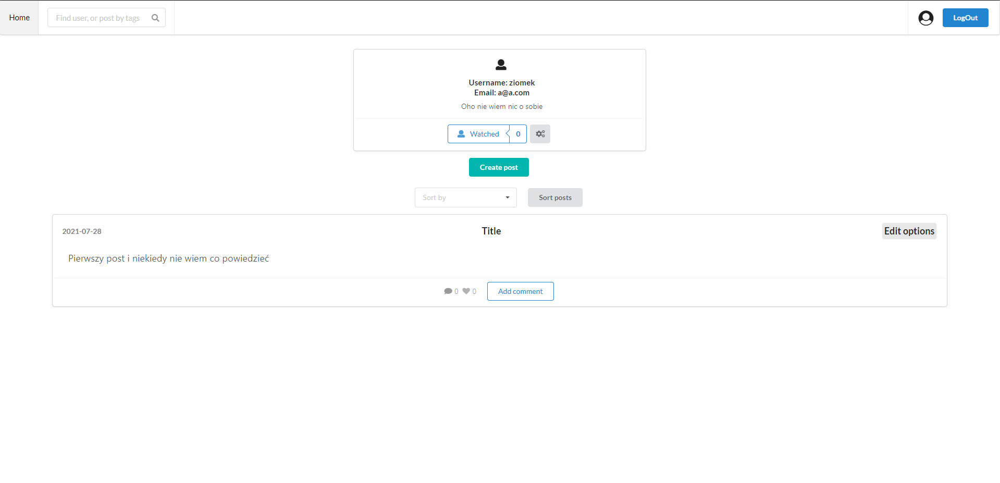
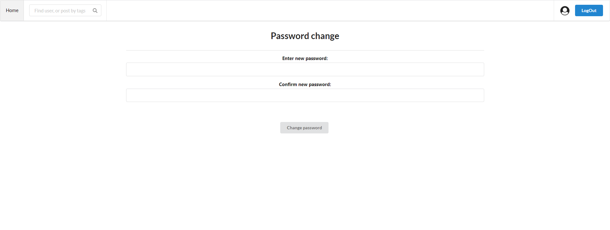
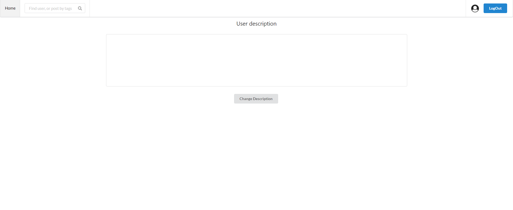
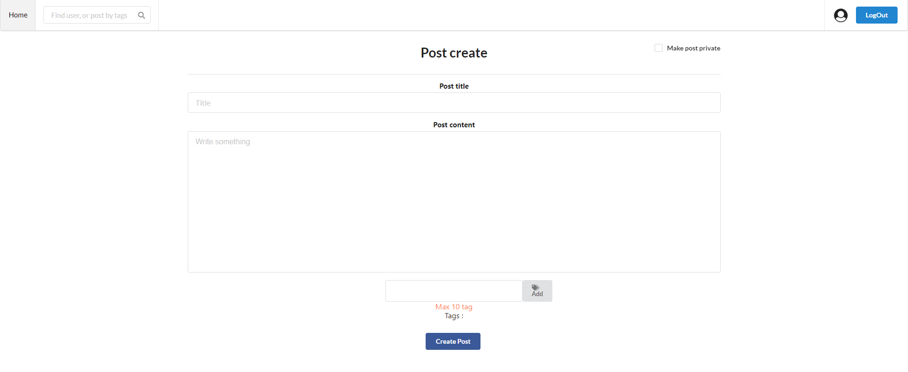
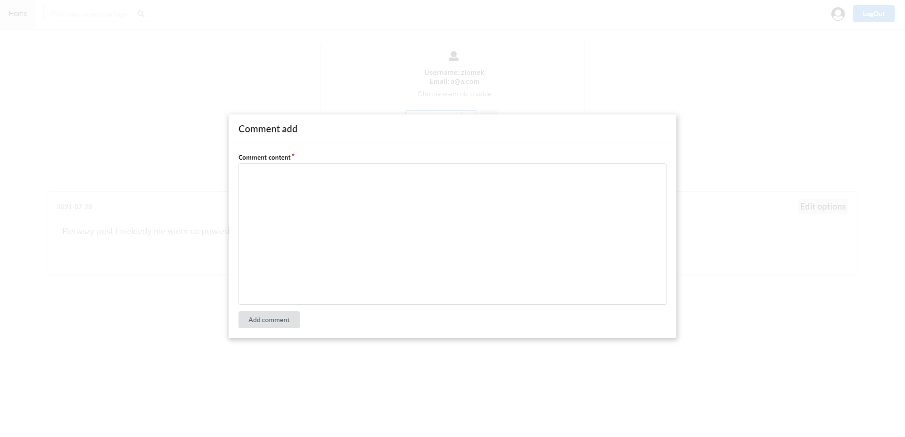

# Example of Blog
Create easy example of blog. User can create post, edit post and delete post. He can watch other user to easy find them or see their posts. In future maybe add some other stuff
## Stack
### Backend
 - Server: Express.js
 - Database: mongodb with mongoose + atlas to online host database
 - passport.js to authenticate user and express-session to store user in cookie
 - bcryptjs to encypt user password
 - Test using nyc + mocha + chai + supertest
### Frontend
 - React.js
 - UI components - semantic-ui-react
 - Store data between components - mobx
 - Store user cookie - js-cookie

## Images
### Login & Signup

### User site

### Settings

### New post and comment

